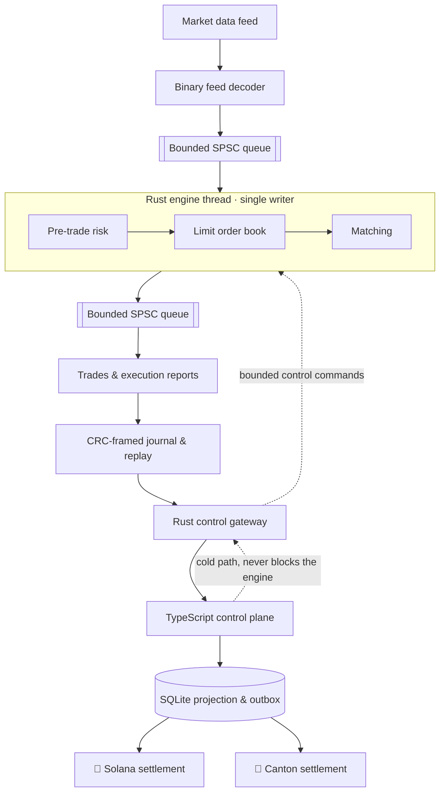

# ⚡ Rust Low-Latency Trading Lab

**A deterministic electronic trading core in Rust, with a measured latency pipeline, a TypeScript control plane, and digital-asset settlement on Solana and Canton.**

[](https://github.com/ayushmishra2005/rust-low-latency-trading-lab/actions/workflows/ci.yml)
[](https://www.rust-lang.org)
[](https://nodejs.org)
[](LICENSE)

This is an open-source engineering lab. It exists to show how a low-latency trading system is
actually built: integer-only domain types, a hand-specified binary market-data protocol, a
price-time limit order book, deterministic matching, pre-trade risk, bounded single-writer
concurrency, byte-exact replay, honest measurement, and a settlement boundary that stays off the
execution path.

It is **not** a production exchange, broker, or high-frequency trading platform, it contains no
trading strategy, and it is not evidence of production HFT deployment. Every performance number
below comes from a real run on the machine named next to it.

---

## 📚 Contents

- [Architecture](#️-architecture)
- [What the engine guarantees](#-what-the-engine-guarantees)
- [Quick start](#-quick-start)
- [Deterministic replay](#-deterministic-replay)
- [Pre-trade risk](#️-pre-trade-risk)
- [Benchmarks](#-benchmarks)
- [Control plane](#-control-plane)
- [Settlement](#️-settlement)
- [Testing](#-testing)
- [Repository layout](#-repository-layout)
- [Development workflow](#-development-workflow)
- [License](#-license)

---

## 🏗️ Architecture

The hot path is a single writer. Market data is decoded, normalized, and handed to one engine
thread that owns all trading state; risk, book, and matching run inline on that thread; outputs
leave over a bounded queue. Everything operational — HTTP, JSON, SQLite, metrics, blockchains —
lives on the cold path and can never block execution.



Nothing on the dashed edges can stall matching: control commands are applied between inputs from a
bounded queue, and the kill switch is a single atomic latch the engine reads before each input.

---

## 🦀 What the engine guarantees

| Guarantee | How it is enforced |
| --- | --- |
| No floating point in economics | Prices, quantities, notionals, positions, and limits are integer newtypes with checked arithmetic |
| Strict price-time priority | `BTreeMap` price levels over a slab-backed intrusive FIFO, with an invariant check available at every step |
| Deterministic output ordering | Each fill emits trade, maker report, then taker report, with dense monotonic output sequences |
| Byte-exact reproducibility | BLAKE3 digests over the input stream, the output stream, and the full engine state |
| Single-writer state | Only the engine thread mutates trading state; no mutex protects the book |
| Nothing silently dropped | Trading requests, reports, and trades apply backpressure; if the journal cannot record an event the engine stops and the run fails; only telemetry may drop, and every drop is counted |
| Decoder safety | Every field is bounds-checked, frames are length- and CRC-validated, and arbitrary bytes are property-tested and fuzzed |

**Order semantics.** Limit orders are good-til-cancelled and rest; market orders are bounded by a
protection price derived from the reference market and never rest. Self-trading is allowed and
reported normally, because this is a lab, not a venue with self-match prevention rules.

**Replace semantics.** A same-price quantity decrease keeps queue priority. A price change or a
quantity increase loses priority. The new total may never fall below the cumulative filled
quantity. A replace may not change the side or the order type, and the resting order is the
canonical source of both. Every check runs before any mutation, so a rejected replace leaves the
order untouched.

**Market data.** Feed prices are validated against the instrument price domain. A snapshot level,
level update, or trade outside that domain puts the feed into a gap rather than becoming a
reference price, so a hostile or corrupt feed cannot move the collar.

---

## 🚀 Quick start

Requires a stable Rust toolchain (1.85+). Everything below runs offline.

```bash
# Build and run the whole test suite
cargo test --workspace

# Generate a deterministic binary feed, then replay it
cargo run --release -p simulator -- generate --seed 1 --events 500 --out /tmp/lab.feed
cargo run --release -p simulator -- replay --input /tmp/lab.feed

# Prove the run is reproducible: two replays, three matching digests
cargo run --release -p simulator -- verify --input /tmp/lab.feed

# Measure queue and pipeline latency at a stated offered load
cargo run --release -p simulator -- bench --wait busy-spin --rate 100000
```

`replay` prints the input, output, and state digests along with queue high-water marks; `step`
walks the run one input at a time for debugging; `bench` prints the environment it measured on.

To run the operational stack, start the gateway and then the control API:

```bash
RLTL_CONTROL_TOKEN=dev-token cargo run --release -p control-gateway -- \
  --socket /tmp/rltl-control.sock --journal /tmp/rltl-engine.journal

cd apps/control-api && npm ci
RLTL_CONTROL_TOKEN=dev-token RLTL_API_TOKEN=dev-api npm start
curl -s localhost:8080/book/LAB-USD | jq
```

---

## 🔁 Deterministic replay

The engine is a pure state machine: `apply(input, logical_time, output_buffer)`. It performs no I/O,
reads no clock, and spawns no tasks, so the same inputs always produce the same outputs and the same
final state.

There is one input stream. Market data, order requests, and control commands are sequenced at the
point the engine applies them, not by the producers that supply them, so an operator action taken
mid-run lands in the recorded stream in the order the engine actually saw it. Replaying that stream
reproduces a controlled run exactly; the wall-clock moment the operator pressed the button is not
reproduced, and does not need to be.

Three digests are recorded over canonical encodings, never over memory layout, pointers, hash-map
order, padding, or wall-clock time:

- **input digest** — every input the engine applied, control commands included
- **output digest** — every trade, execution report, and state event it produced
- **state digest** — every piece of state that can change a future decision: sequences, next
  identifiers, the kill latch, feed state and epoch, the last trade price, the levels of a snapshot
  still in progress, visible market levels, book levels with their FIFO order, and per-account
  positions, reservations, limits, and dedup entries

Each variable-length section of the state encoding carries a tag and an entry count, so two
different collection shapes cannot produce the same bytes. The encoding is versioned
(`STATE_SCHEMA_VERSION`); the golden fixtures are regenerated whenever it changes.

Periodic checkpoints make divergence cheap to locate: instead of "the run differs", you get the
first checkpoint where the digests split. Threaded runs are verified against single-threaded replay
in the test suite, including runs with an account disable, a risk-limit change, and kill switch
transitions, so neither concurrency nor operator action can change the result.

---

## 🛡️ Pre-trade risk

Risk runs inline on the engine thread, in a fixed order, before anything touches the book:

1. Duplicate request detection against a bounded per-account window
2. Field, account, and instrument validation
3. Kill switch and per-account enablement
4. Client sequence monotonicity
5. Market synchronisation and staleness
6. Maximum order quantity
7. Price collar, protection price, and maximum order notional
8. Worst-case position and gross exposure, including working-order reservations
9. Book capacity

Reservations are the part that is easy to get wrong: a working order already consumes limit capacity,
so exposure is evaluated against the worst case if every resting order filled. Reservations are
released on fill, cancel, and replace, and a test asserts they always match the live order set.

The kill switch is fail-closed: it is an atomic latch the engine reads before every input, so it
takes effect even if the control queue is saturated. The latch is the only source of kill state, so
engaging, releasing, and engaging again all reach the engine, and each transition is recorded once.

---

## 📈 Benchmarks

> Real measurements only. Every number below was produced by the commands shown, on the machine
> described. Re-run them yourself; they will differ on your hardware.

**Environment:** Apple M5 Max, 18 logical cores, macOS 25.6.0 (aarch64), rustc 1.97.1, release
profile, commit `4d84465` with this pass applied. This is a development laptop, not an isolated
measurement host.

### Microbenchmarks (Criterion, `cargo bench -p trading-core`)

| Benchmark | Median | Notes |
| --- | --- | --- |
| `codec/decode_one_frame` | 26.1 ns | One market-data frame, bounds- and CRC-checked |
| `book/insert_1000` | 15.5 µs | 1,000 resting orders across 50 price levels |
| `book/cancel_head` | 23.5 µs | 1,000 cancels by order id, O(1) unlink each |
| `book/match_multi_level_sweep` | 20.6 µs | Aggressive order sweeping a 1,000-order book |
| `engine/accepted_new_limit` | 229 µs | 1,000 accepted orders on a fresh core: dedup, risk, book insert, report |
| `engine/rejected_risk_check` | 173 µs | 1,000 orders ending in a risk rejection |
| `engine/apply_generated_workload` | 1.50 ms | 10,000 mixed events, about 150 ns per event |

The two engine benchmarks measure batches of 1,000 orders against a freshly prepared core, because
a single long-lived core fills its 4,096-order capacity and starts rejecting. Each batch asserts
that every order took the intended path, and the bench binary prints an acceptance check before
Criterion measures anything.

### Engine pipeline latency (`cargo run --release -p simulator -- bench --wait busy-spin --runs 5`)

**Boundary:** feed thread → bounded SPSC queue → engine → output thread. No journal, no snapshots,
no control API, no settlement. Two start points are measured separately and never combined:

- **scheduled-arrival-to-report** starts at the instant the input was due on the offered schedule,
  so it includes any time the producer spent behind that schedule
- **enqueue-to-report** starts when the producer actually handed the input over, so it excludes
  producer scheduling debt

Each offered rate is run six times: one warm-up run that is not published, then five measured runs.
The tables give the median across the five runs, with the lowest and highest run in brackets, so the
run-to-run spread is visible. These are not confidence intervals. Every individual run is printed by
the command above. Workload: 200,000 generated events, 252,024 measured order reports per run,
`busy-spin` wait strategy, 4,096-entry queues.

**scheduled-arrival-to-report**

| Offered load | p50 | p99 | p99.9 | max | Throughput | Generator behind |
| --- | --- | --- | --- | --- | --- | --- |
| 100,000 msg/s | 750 ns [708–750] | 6.75 µs [6.58–7.17] | 30.3 µs [28.5–35.4] | 66.0 µs [56.9–91.6] | 99,998 msg/s | 331 of 200,000 |
| 500,000 msg/s | 666 ns [666–667] | 8.71 µs [7.25–9.09] | 42.0 µs [36.7–44.6] | 87.0 µs [71.0–94.8] | 499,961 msg/s | 1,263 of 200,000 |
| unpaced | 1.04 ms [1.02–1.05] | 1.21 ms [1.14–1.23] | 1.23 ms [1.16–1.29] | 1.23 ms [1.16–1.30] | 3,922,315 msg/s | 0 |

**enqueue-to-report**

| Offered load | p50 | p99 | p99.9 | max |
| --- | --- | --- | --- | --- |
| 100,000 msg/s | 709 ns [708–750] | 4.54 µs [4.42–4.71] | 27.0 µs [24.9–30.1] | 66.0 µs [55.9–84.5] |
| 500,000 msg/s | 666 ns [666–667] | 5.63 µs [4.63–6.13] | 37.1 µs [29.8–39.8] | 79.4 µs [62.8–94.6] |
| unpaced | 1.04 ms [1.02–1.05] | 1.21 ms [1.14–1.23] | 1.23 ms [1.16–1.29] | 1.23 ms [1.16–1.30] |

The gap between the two tables is the producer falling behind its own schedule: at 500,000 msg/s the
generator missed its slot 1,263 times, which moves p99 from 5.63 µs to 8.71 µs. Unpaced has no
schedule, so the two boundaries are identical there.

The unpaced row is deliberately included: with an infinite offered load the queue stays full, so the
measurement becomes queue residence, not coordination latency. That is why latency is only quoted at
a stated offered load.

**These are development benchmarks taken on a macOS laptop, not isolated production-host latency
claims.** There is no core pinning, no isolated CPU set, no interrupt steering, and other processes
were running. Tail percentiles in particular should be read as "what this laptop did five times in a
row", not as a platform guarantee.

### Runtime with journal (same command)

**Boundary:** the shipped `run()` path — canonical input recording and digests, the CRC-framed
journal, snapshots every 1,000 engine sequences, and the same queue and runtime code the pipeline
uses. Solana, Canton, Node, and external settlement are excluded. This path carries no per-event
wall-clock stamp, so only whole-run throughput is reported, not latency percentiles. Workload: 5,000
generated events producing 5,261 inputs and 7,107 journal records; five measured runs each.

| Journal mode | Throughput (median of 5) | Range | What it guarantees |
| --- | --- | --- | --- |
| `Buffered` | 1,091,786 msg/s | 618,522 – 1,095,746 | Flush when the buffer fills or the run ends |
| `GroupCommit(64)` | 1,065,734 msg/s | 1,020,389 – 1,068,367 | Visible within 64 records or on queue drain, no `fsync` |
| `Durable` | 228 msg/s | 226 – 228 | `fsync` per output event |

Durable acknowledgement costs roughly four thousand times the throughput of group commit on this
laptop's filesystem. That is the honest price of one `fsync` per event, and it is why the gateway
uses group commit and states that it is a visibility bound rather than a durability one.

### Queue coordination (ping-pong over two SPSC queues, 100,000 samples, one run)

| Wait strategy | p50 | p99 | p99.9 |
| --- | --- | --- | --- |
| busy spin | 250 ns | 333 ns | 542 ns |
| adaptive | 292 ns | 416 ns | 5.38 µs |
| sleep | 80.0 µs | 166 µs | 171 µs |

The wait strategy dominates end-to-end latency at low load: an engine thread that parked wakes tens
of microseconds late. Busy spin buys latency with a core, which is the trade a real venue makes.

---

## 🟦 Control plane

Two processes sit between an operator and the engine, and neither can slow it down.

**Rust control gateway.** Tokio serves a local Unix socket using length-prefixed JSON. Every message
carries a schema version and a command id, frames are bounded before parsing, and each response
reports the engine sequence it was answered at. All 64- and 128-bit values cross the boundary as
decimal strings, because JavaScript numbers cannot represent them exactly. Reads come from the
journal and from periodic engine snapshots; mutations require a shared token and are refused
outright when no token is configured.

**Journal visibility and durability are different things, and the code keeps them apart.** The
output thread writes CRC-framed records through a buffer, and `JournalSync` chooses when that buffer
is pushed:

| Mode | Contract |
| --- | --- |
| `Buffered` | The buffer is flushed when it fills and at the end of the run. Cheapest; a reader may not see recent records. |
| `GroupCommit(n)` | The buffer is flushed after at most `n` records and whenever the output queue drains, so a reader sees every record within that bound. This is visibility, not durability: there is no `fsync`. |
| `Durable` | Every record is flushed and `fsync`ed before the next one is written. Visible and durable, at one `fsync` per output event. |

The gateway runs `GroupCommit`, because it tails the journal and must not be reading a buffer that
may never be published. Engine acknowledgement — the engine applied the input and emitted output —
happens earlier and is a separate fact from either of these. If a journal write fails, the engine
stops rather than continuing without a record.

**Snapshots are bounded by depth, not by book size.** The engine publishes a read model at a
configured interval, on the trading thread, so capture reads at most the top `depth` levels per side
and `depth * 8` orders per instrument. It iterates the ordered structures directly: the book is never
cloned and then truncated. A test measures capture against a 100-order book and a 4,000-order book at
the same depth and asserts the cost does not follow the live order count.

The tail reader is incremental: it holds a file positioned at the last committed offset, reads only
bytes appended since the previous poll, holds an incomplete trailing record until the writer
finishes it, and reports corruption at the offset where it occurred. Gateway requests that touch the
filesystem run on a blocking Tokio task rather than on a reactor worker.

**TypeScript control API.** Fastify with strict TypeScript and JSON Schema validation on every
request. It tails the gateway, applies the output stream to a SQLite projection, and serves:

| Endpoint | Purpose |
| --- | --- |
| `GET /book/:symbol` | Depth from the latest engine snapshot, with `asOfEngineSeq` |
| `GET /orders`, `GET /trades`, `GET /positions` | Projected state, with the projection position |
| `GET /settlements` | Settlement outbox status |
| `GET /health`, `GET /metrics` | Health, and OpenMetrics exposition with bounded labels |
| `POST /risk/limits`, `POST /engine/kill`, `POST /replay/start` | Bearer-authenticated operations |
| `GET /stream` (WebSocket) | Projected events carrying a projection sequence for gap detection |

There is deliberately **no order entry** in the operational API. Operational tooling changes limits
and stops trading; it does not send orders.

Observability follows the same rule: labels are bounded to symbols, feed states, settlement statuses,
and the fixed reject-reason enum. Order, account, and trade identifiers are never used as labels, and
no log formatting happens on the trading thread.

---

## ⛓️ Settlement

Settlement is a boundary, not a step in execution. **An executed trade stays executed even if
settlement is delayed, unknown, or retried.**

The projection groups unsettled trades into batches in a SQLite outbox. Each batch gets a settlement
identity derived from its trade range and a canonical manifest hash over its contents. Retries reuse
both, so a timeout can never create a second economic identity. That manifest hash is the outbox's
own record of the batch; each venue additionally binds its settlement to the economics it actually
applies, in the way that venue can prove — see below.

```
pending ──▶ submitted ──▶ confirmed        (terminal)
                    └──▶ unknown ──▶ submitted | confirmed | failed
```

`unknown` is not a failure. A settlement is only marked failed when the venue rejected it, and a
confirmation can never be undone by a later timeout.

### 🔷 Solana

A minimal Anchor program holds collateral in PDA-isolated accounts and applies batch settlements:
`initialize_exchange`, `open_collateral`, `deposit_collateral`, `withdraw_collateral`,
`freeze_account`, and `settle_batch`. It validates signers, PDA seeds, account ownership, the mint
and token program, the exchange authority, and every amount, and uses checked arithmetic throughout.
Before a batch mutates anything it checks each supplied collateral account: writable, unique by
public key, owned by this exchange, and at its canonical PDA address. That closes the classic
duplicate-mutable-account hole where the same account appears twice in one batch and one leg
overwrites another.

**The manifest hash is proved on chain, not trusted.** There is one canonical binary encoding of a
batch: a 16-byte domain tag `RLTL-SETTLE-V1  `, the 16-byte settlement id, the 32-byte exchange key,
the leg count as `u16` little-endian, then each leg in order as payer collateral key (32 bytes),
payee collateral key (32 bytes), amount as `u64` little-endian. Note that a leg is identified by the
collateral account key, never by its index into the remaining accounts. The program resolves every
leg, hashes that preimage with sha256, and rejects the batch with `ManifestMismatch` unless the
result equals the supplied hash — before any balance moves. The TypeScript client builds the same
bytes with node's built-in `crypto`, and a golden vector (two legs, 210-byte preimage, hash
`d11c5555…`) is asserted from both Rust and TypeScript, so the two encoders cannot drift apart.
Changing an amount, swapping a payer or payee, or reordering the legs while keeping the old hash is
rejected, and each of those is a test.

Idempotency comes from a receipt PDA keyed by the settlement identity: submitting the same identity
twice fails, and the client resolves the outcome by reading the receipt. Different economics under
the same identity are refused, whether or not the hash matches them. The program targets the classic
SPL Token program; broad Token-2022 support is not implemented or claimed. Tests run against a local
validator, never a public RPC.

### 🔐 Canton

A Daml settlement workflow models the smallest useful flow: an operator proposes a
`SettlementInstruction` covering one or more legs, every affected party accepts, and `Settle` applies
all legs atomically and creates a `SettlementReceipt` keyed by the settlement identity. Duplicate
identities, partial acceptance, and insufficient holdings are all rejected by the ledger.

**The receipt records what was settled, rather than a string the client supplied.** `Settle` takes
the legs the caller believes it is settling and refuses to run unless they match the instruction,
leg for leg and count included. The receipt then stores the applied legs, their count, and a
canonical text encoding — `settlementId|legCount|payer>payee:amount|…` — that the ledger derives
from those legs. It is a deterministic encoding, not a cryptographic hash: Daml SDK 2.10.6 exposes no
sha256 to contract code, and the off-chain manifest covers trade ids, instrument, price ticks, and
quantities that the ledger never receives, so recomputing the client's digest on the ledger is not
possible and is not pretended. Reconciliation therefore compares stored economics, not a copied
string. Changing an amount or a participant under the same identity is rejected, and an exact
duplicate stays idempotent. What this does not prove: nothing on the ledger links the netted legs
back to the individual trades, so a client that nets the wrong trades into well-formed legs would
still settle.

The `Holding` template is an explicit lab placeholder for a real holding, not a token standard
implementation: the Canton Network Token Standard packages are not deployed on a plain sandbox, so
this model settles against its own minimal holdings and would be pointed at the deployed standard on
a real network. Verified against Daml SDK 2.10.6 with the HTTP JSON API; the TypeScript venue talks
to that API and treats an unreachable participant as unknown, never as failed.

---

## 🧪 Testing

```bash
cargo test --workspace                       # unit, golden, property, threaded, replay
cd apps/control-api && npm test              # control plane, projection, settlement
cd adapters/canton && daml test              # Daml settlement workflow
cd adapters/solana && anchor test            # Solana program on a local validator
```

What the suite actually checks:

- **Reference model** — a deliberately simple `VecDeque` order book is driven alongside the indexed
  one under property tests; the two must agree after every command
- **Golden fixtures** — recorded feeds with recorded digests, so an accidental behaviour change fails
  loudly instead of silently
- **Decoder hardening** — arbitrary bytes, every truncated prefix, and single-bit flips are property
  tested; four `cargo-fuzz` targets cover the frame, header, and output decoders. Random mutation
  almost never produces a correct CRC, so the raw frame target rarely gets past framing; a fourth
  target normalizes only the length, reserved flags, schema version, and checksum, leaving the
  message type, header fields, and payload to the fuzzer, so payload parsing is actually reachable.
  Nothing in the decoder is bypassed or reimplemented, and a unit test proves a real frame body
  survives that wrapper and decodes
- **Threaded equivalence** — a three-thread run must reproduce the single-threaded replay digests
- **Invariants** — reservations match live orders, positions net to zero, cumulative fills never
  exceed the accepted total, output sequences never skip
- **Failure injection** — gateway restart, silent gateway, corrupt journal tail, duplicate output,
  database restart mid-flight, venue unavailable, timeout after the venue applied a batch, manifest
  conflict, and telemetry saturation

---

## 📂 Repository layout

```
crates/protocol         Integer domain types, binary feed codec, canonical output encoding
crates/trading-core     Market view, order book, matching, risk, engine state machine, replay
crates/engine-runtime   Threads, bounded SPSC queues, journal, snapshots, latency harness
crates/control-gateway  Cold IPC boundary between the engine and the control plane
apps/simulator          Generate, replay, step, verify, and benchmark from the command line
apps/control-api        TypeScript operational API, SQLite projection, settlement outbox
adapters/solana         Anchor settlement program and its local-validator tests
adapters/canton         Daml settlement workflow and its Daml Script tests
fixtures/               Recorded feeds and their expected digests
fuzz/                   libFuzzer targets for the decoders
```

---

## 🔀 Development Workflow

1. Branch from `main` with a descriptive name, for example `feat/replace-priority-rules`,
   `fix/journal-tail-recovery`, or `perf/book-cancel-path`.
2. Keep each change focused. One behavioural change per pull request is much easier to review than
   a mixed refactor.
3. Run the local checks before pushing:
   ```bash
   cargo fmt --all
   cargo clippy --workspace --all-targets --all-features -- -D warnings
   cargo test --workspace
   cd apps/control-api && npm run typecheck && npm run lint && npm test
   ```
4. Write a clear commit message in conventional style, for example
   `feat(book): keep priority on a same-price decrease`.
5. Open a pull request describing what changed, why, and how it was verified. Include benchmark
   output if the change is about performance, and say which machine produced it.
6. CI must pass. It runs formatting, `cargo check`, Clippy with warnings denied, the full Rust test
   suite, replay verification against the golden fixtures, the fuzz target build, the TypeScript
   typecheck, lint and tests, the Solana program against a local validator, and the Daml workflow
   tests. No job depends on a public RPC endpoint, a public ledger, a paid API, or a secret.
7. Squash or rebase so the merged history stays readable.

---

## 📜 License

[MIT](LICENSE) © Ayush Kumar Mishra
