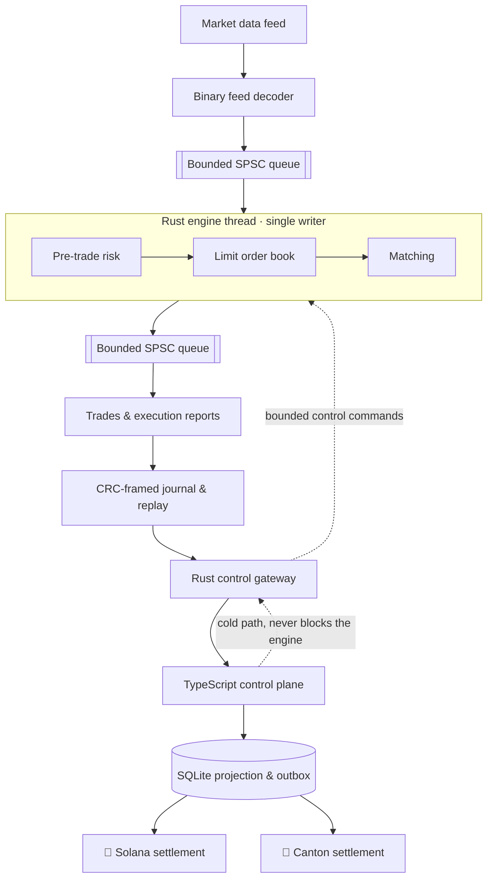

# ⚡ Rust Low-Latency Trading Lab

**A deterministic electronic trading core in Rust, with a measured latency pipeline, a TypeScript control plane, and digital-asset settlement on Solana and Canton.**

[](https://github.com/ayushmishra2005/rust-low-latency-trading-lab/actions/workflows/ci.yml)
[](https://www.rust-lang.org)
[](https://nodejs.org)
[](LICENSE)

This is an open-source engineering lab. It exists to show how a low-latency trading system is
actually built: integer-only domain types, a hand-specified binary market-data protocol, a
price-time limit order book, deterministic matching, pre-trade risk, bounded single-writer
concurrency, byte-exact replay, honest measurement, and a settlement boundary that stays off the
execution path.

It is **not** a production exchange, broker, or high-frequency trading platform, it contains no
trading strategy, and it is not evidence of production HFT deployment. Every performance number
below comes from a real run on the machine named next to it.

---

## 📚 Contents

- [Architecture](#️-architecture)
- [What the engine guarantees](#-what-the-engine-guarantees)
- [Quick start](#-quick-start)
- [Deterministic replay](#-deterministic-replay)
- [Pre-trade risk](#️-pre-trade-risk)
- [Benchmarks](#-benchmarks)
- [Control plane](#-control-plane)
- [Settlement](#️-settlement)
- [Testing](#-testing)
- [Repository layout](#-repository-layout)
- [Development workflow](#-development-workflow)
- [License](#-license)

---

## 🏗️ Architecture

The hot path is a single writer. Market data is decoded, normalized, and handed to one engine
thread that owns all trading state; risk, book, and matching run inline on that thread; outputs
leave over a bounded queue. Everything operational — HTTP, JSON, SQLite, metrics, blockchains —
lives on the cold path and can never block execution.



Nothing on the dashed edges can stall matching: control commands are applied between inputs from a
bounded queue, and the kill switch is a single atomic latch the engine reads before each input.

---

## 🦀 What the engine guarantees

| Guarantee | How it is enforced |
| --- | --- |
| No floating point in economics | Prices, quantities, notionals, positions, and limits are integer newtypes with checked arithmetic |
| Strict price-time priority | `BTreeMap` price levels over a slab-backed intrusive FIFO, with an invariant check available at every step |
| Deterministic output ordering | Each fill emits trade, maker report, then taker report, with dense monotonic output sequences |
| Byte-exact reproducibility | BLAKE3 digests over the input stream, the output stream, and the full engine state |
| Single-writer state | Only the engine thread mutates trading state; no mutex protects the book |
| Nothing silently dropped | Trading requests, reports, and trades apply backpressure; only telemetry may drop, and every drop is counted |
| Decoder safety | Every field is bounds-checked, frames are length- and CRC-validated, and arbitrary bytes are property-tested and fuzzed |

**Order semantics.** Limit orders are good-til-cancelled and rest; market orders are bounded by a
protection price derived from the reference market and never rest. Self-trading is allowed and
reported normally, because this is a lab, not a venue with self-match prevention rules.

**Replace semantics.** A same-price quantity decrease keeps queue priority. A price change or a
quantity increase loses priority. The new total may never fall below the cumulative filled
quantity. Every check runs before any mutation, so a rejected replace leaves the order untouched.

---

## 🚀 Quick start

Requires a stable Rust toolchain (1.85+). Everything below runs offline.

```bash
# Build and run the whole test suite
cargo test --workspace

# Generate a deterministic binary feed, then replay it
cargo run --release -p simulator -- generate --seed 1 --events 500 --out /tmp/lab.feed
cargo run --release -p simulator -- replay --input /tmp/lab.feed

# Prove the run is reproducible: two replays, three matching digests
cargo run --release -p simulator -- verify --input /tmp/lab.feed

# Measure queue and pipeline latency at a stated offered load
cargo run --release -p simulator -- bench --wait busy-spin --rate 100000
```

`replay` prints the input, output, and state digests along with queue high-water marks; `step`
walks the run one input at a time for debugging; `bench` prints the environment it measured on.

To run the operational stack, start the gateway and then the control API:

```bash
RLTL_CONTROL_TOKEN=dev-token cargo run --release -p control-gateway -- \
  --socket /tmp/rltl-control.sock --journal /tmp/rltl-engine.journal

cd apps/control-api && npm ci
RLTL_CONTROL_TOKEN=dev-token RLTL_API_TOKEN=dev-api npm start
curl -s localhost:8080/book/LAB-USD | jq
```

---

## 🔁 Deterministic replay

The engine is a pure state machine: `apply(input, logical_time, output_buffer)`. It performs no I/O,
reads no clock, and spawns no tasks, so the same inputs always produce the same outputs and the same
final state.

Three digests are recorded over canonical encodings, never over memory layout, pointers, hash-map
order, padding, or wall-clock time:

- **input digest** — every normalized input the engine consumed
- **output digest** — every trade, execution report, and state event it produced
- **state digest** — the full engine state: sequences, next identifiers, market view, book levels
  with their FIFO order, and per-account positions, reservations, and limits

Periodic checkpoints make divergence cheap to locate: instead of "the run differs", you get the
first checkpoint where the digests split. Threaded runs are verified against single-threaded replay
in the test suite, so concurrency cannot change the result.

---

## 🛡️ Pre-trade risk

Risk runs inline on the engine thread, in a fixed order, before anything touches the book:

1. Duplicate request detection against a bounded per-account window
2. Field, account, and instrument validation
3. Kill switch and per-account enablement
4. Client sequence monotonicity
5. Market synchronisation and staleness
6. Maximum order quantity
7. Price collar, protection price, and maximum order notional
8. Worst-case position and gross exposure, including working-order reservations
9. Book capacity

Reservations are the part that is easy to get wrong: a working order already consumes limit capacity,
so exposure is evaluated against the worst case if every resting order filled. Reservations are
released on fill, cancel, and replace, and a test asserts they always match the live order set.

The kill switch is fail-closed: it is an atomic latch the engine reads before every input, so it
takes effect even if the control queue is saturated.

---

## 📈 Benchmarks

> Real measurements only. Every number below was produced by the commands shown, on the machine
> described. Re-run them yourself; they will differ on your hardware.

**Environment:** Apple M5 Max, 18 logical cores, macOS 25.6.0 (aarch64), rustc 1.97.1, release
profile.

### Microbenchmarks (Criterion, `cargo bench -p trading-core`)

| Benchmark | Median | Notes |
| --- | --- | --- |
| `codec/decode_one_frame` | 25.8 ns | One market-data frame, bounds- and CRC-checked |
| `book/insert_1000` | 15.5 µs | 1,000 resting orders across 50 price levels |
| `book/cancel_head` | 22.3 µs | 1,000 cancels by order id, O(1) unlink each |
| `book/match_multi_level_sweep` | 20.5 µs | Aggressive order sweeping a 1,000-order book |
| `engine/accepted_new_limit` | 167 ns | Full path: dedup, risk, book insert, report |
| `engine/rejected_risk_check` | 160 ns | Full path ending in a risk rejection |
| `engine/apply_generated_workload` | 1.48 ms | 10,000 mixed events, about 148 ns per event |

### Pipeline latency (`cargo run --release -p simulator -- bench --wait busy-spin`)

Order-to-report latency across three threads and two bounded SPSC queues, measured with an
independent monotonic schedule so a stall shows up as reduced throughput rather than reduced
offered load.

| Offered load | p50 | p95 | p99 | p99.9 | max | Throughput |
| --- | --- | --- | --- | --- | --- | --- |
| 100,000 msg/s | 750 ns | 1.54 µs | 4.17 µs | 24.8 µs | 67.3 µs | 99,998 msg/s |
| 500,000 msg/s | 708 ns | 1.46 µs | 7.17 µs | 30.6 µs | 58.8 µs | 499,958 msg/s |
| unpaced | 1.07 ms | 1.14 ms | 1.16 ms | 1.18 ms | 1.18 ms | 3,834,229 msg/s |

The unpaced row is deliberately included: with an infinite offered load the queue stays full, so the
measurement becomes queue residence, not coordination latency. That is why latency is only quoted at
a stated offered load.

### Queue coordination (ping-pong over two SPSC queues, 100,000 samples)

| Wait strategy | p50 | p99 | p99.9 |
| --- | --- | --- | --- |
| busy spin | 250 ns | 334 ns | 542 ns |
| adaptive | 292 ns | 375 ns | 666 ns |
| sleep | 67.6 µs | 141 µs | 145 µs |

The wait strategy dominates end-to-end latency at low load: an engine thread that parked wakes tens
of microseconds late. Busy spin buys latency with a core, which is the trade a real venue makes.

---

## 🟦 Control plane

Two processes sit between an operator and the engine, and neither can slow it down.

**Rust control gateway.** Tokio serves a local Unix socket using length-prefixed JSON. Every message
carries a schema version and a command id, frames are bounded before parsing, and each response
reports the engine sequence it was answered at. All 64- and 128-bit values cross the boundary as
decimal strings, because JavaScript numbers cannot represent them exactly. Reads come from the
durable journal and from periodic engine snapshots; mutations require a shared token and are
refused outright when no token is configured.

**TypeScript control API.** Fastify with strict TypeScript and JSON Schema validation on every
request. It tails the gateway, applies the output stream to a SQLite projection, and serves:

| Endpoint | Purpose |
| --- | --- |
| `GET /book/:symbol` | Depth from the latest engine snapshot, with `asOfEngineSeq` |
| `GET /orders`, `GET /trades`, `GET /positions` | Projected state, with the projection position |
| `GET /settlements` | Settlement outbox status |
| `GET /health`, `GET /metrics` | Health, and OpenMetrics exposition with bounded labels |
| `POST /risk/limits`, `POST /engine/kill`, `POST /replay/start` | Bearer-authenticated operations |
| `GET /stream` (WebSocket) | Projected events carrying a projection sequence for gap detection |

There is deliberately **no order entry** in the operational API. Operational tooling changes limits
and stops trading; it does not send orders.

Observability follows the same rule: labels are bounded to symbols, feed states, settlement statuses,
and the fixed reject-reason enum. Order, account, and trade identifiers are never used as labels, and
no log formatting happens on the trading thread.

---

## ⛓️ Settlement

Settlement is a boundary, not a step in execution. **An executed trade stays executed even if
settlement is delayed, unknown, or retried.**

The projection groups unsettled trades into batches in a SQLite outbox. Each batch gets a settlement
identity derived from its trade range and a canonical manifest hash over its contents. Retries reuse
both, so a timeout can never create a second economic identity.

```
pending ──▶ submitted ──▶ confirmed        (terminal)
                    └──▶ unknown ──▶ submitted | confirmed | failed
```

`unknown` is not a failure. A settlement is only marked failed when the venue rejected it, and a
confirmation can never be undone by a later timeout.

### 🔷 Solana

A minimal Anchor program holds collateral in PDA-isolated accounts and applies batch settlements:
`initialize_exchange`, `open_collateral`, `deposit_collateral`, `withdraw_collateral`,
`freeze_account`, and `settle_batch`. It validates signers, PDA seeds, account ownership, the mint
and token program, the exchange authority, and every amount, and uses checked arithmetic throughout.

Idempotency comes from a receipt PDA keyed by the settlement identity: submitting the same identity
twice fails, and the client resolves the outcome by reading the receipt. A different manifest under
the same identity is refused. The program targets the classic SPL Token program; broad Token-2022
support is not implemented or claimed. Tests run against a local validator, never a public RPC.

### 🔐 Canton

A Daml settlement workflow models the smallest useful flow: an operator proposes a
`SettlementInstruction` covering one or more legs, every affected party accepts, and `Settle` applies
all legs atomically and creates a `SettlementReceipt` keyed by the settlement identity. Duplicate
identities, partial acceptance, and insufficient holdings are all rejected by the ledger.

The `Holding` template is an explicit lab placeholder for a real holding, not a token standard
implementation: the Canton Network Token Standard packages are not deployed on a plain sandbox, so
this model settles against its own minimal holdings and would be pointed at the deployed standard on
a real network. Verified against Daml SDK 2.10.6 with the HTTP JSON API; the TypeScript venue talks
to that API and treats an unreachable participant as unknown, never as failed.

---

## 🧪 Testing

```bash
cargo test --workspace                       # unit, golden, property, threaded, replay
cd apps/control-api && npm test              # control plane, projection, settlement
cd adapters/canton && daml test              # Daml settlement workflow
cd adapters/solana && anchor test            # Solana program on a local validator
```

What the suite actually checks:

- **Reference model** — a deliberately simple `VecDeque` order book is driven alongside the indexed
  one under property tests; the two must agree after every command
- **Golden fixtures** — recorded feeds with recorded digests, so an accidental behaviour change fails
  loudly instead of silently
- **Decoder hardening** — arbitrary bytes, every truncated prefix, and single-bit flips are property
  tested; three `cargo-fuzz` targets cover the frame, header, and output decoders
- **Threaded equivalence** — a three-thread run must reproduce the single-threaded replay digests
- **Invariants** — reservations match live orders, positions net to zero, cumulative fills never
  exceed the accepted total, output sequences never skip
- **Failure injection** — gateway restart, silent gateway, corrupt journal tail, duplicate output,
  database restart mid-flight, venue unavailable, timeout after the venue applied a batch, manifest
  conflict, and telemetry saturation

---

## 📂 Repository layout

```
crates/protocol         Integer domain types, binary feed codec, canonical output encoding
crates/trading-core     Market view, order book, matching, risk, engine state machine, replay
crates/engine-runtime   Threads, bounded SPSC queues, journal, snapshots, latency harness
crates/control-gateway  Cold IPC boundary between the engine and the control plane
apps/simulator          Generate, replay, step, verify, and benchmark from the command line
apps/control-api        TypeScript operational API, SQLite projection, settlement outbox
adapters/solana         Anchor settlement program and its local-validator tests
adapters/canton         Daml settlement workflow and its Daml Script tests
fixtures/               Recorded feeds and their expected digests
fuzz/                   libFuzzer targets for the decoders
```

---

## 🔀 Development Workflow

1. Branch from `main` with a descriptive name, for example `feat/replace-priority-rules`,
   `fix/journal-tail-recovery`, or `perf/book-cancel-path`.
2. Keep each change focused. One behavioural change per pull request is much easier to review than
   a mixed refactor.
3. Run the local checks before pushing:
   ```bash
   cargo fmt --all
   cargo clippy --workspace --all-targets --all-features -- -D warnings
   cargo test --workspace
   cd apps/control-api && npm run typecheck && npm run lint && npm test
   ```
4. Write a clear commit message in conventional style, for example
   `feat(book): keep priority on a same-price decrease`.
5. Open a pull request describing what changed, why, and how it was verified. Include benchmark
   output if the change is about performance, and say which machine produced it.
6. CI must pass. It runs formatting, `cargo check`, Clippy with warnings denied, the full Rust test
   suite, replay verification against the golden fixtures, the fuzz target build, the TypeScript
   typecheck, lint and tests, the Solana program against a local validator, and the Daml workflow
   tests. No job depends on a public RPC endpoint, a public ledger, a paid API, or a secret.
7. Squash or rebase so the merged history stays readable.

---

## 📜 License

[MIT](LICENSE) © Ayush Kumar Mishra
